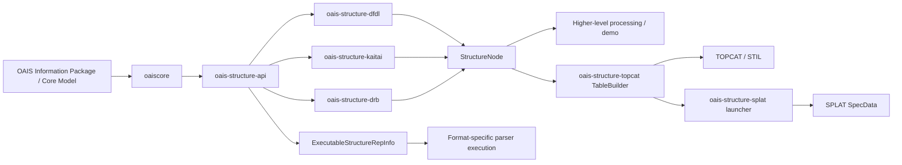

# Archive Manager + OAIS Structure Adapters

This repository combines two projects in one Maven reactor:

- [`archive-manager/`](archive-manager/README.md) — the Spring Boot archive management
  application over RiC-O and OAIS. Its **RepInfo Tools** *generate* Kaitai/DFDL/DRB
  descriptions of a data format.
- The OAIS structure adapters, merged in from
  [dgiaretta/oaisrepinfo](https://github.com/dgiaretta/oaisrepinfo) (described in the rest of
  this README), which *execute* such descriptions against real bytes.

The two meet in RepInfo Tools' "Test against a sample file": a generated DFDL schema or DRB SDF
schema is run through `oais-structure-dfdl` / `oais-structure-drb` against an uploaded sample,
before being saved to the archive as Representation Information. `archive-manager` also takes the OAIS core model from the
`oaiscore` module rather than keeping its own copy.

```bash
mvn install              # builds and tests everything, including archive-manager
mvn install -Psplat      # also oais-structure-splat (needs locally built starjava jars, see below)
```

`archive-manager` is aggregated by the root `pom.xml` but keeps `spring-boot-starter-parent` as
its own parent; the adapter modules' POMs are unchanged from upstream, so later changes to
`oaisrepinfo` can be copied across directly.

---

# OAIS Structure Adapters

This project provides a small Java framework for attaching OAIS `StructureRepInfo`
objects to concrete binary-format parsers without making the core OAIS model depend
on any specific parser implementation.

The repository contains a vendored `oaiscore` module plus three adapter modules:

- `oais-structure-api` — engine-agnostic interfaces and abstractions
- `oais-structure-dfdl` — Apache Daffodil-backed adapter
- `oais-structure-kaitai` — Kaitai Struct-backed adapter
- `oais-structure-drb` — GAEL Java DRB-backed adapter (DRB 2.5.13, LGPL v3)
- `oais-structure-east` — the CCSDS data description language EAST: reader, writer and interpreter
- `oais-structure-demo` — runnable example

## What this project does

The core idea is to keep the OAIS model independent from parsing engines while still
allowing an executable representation of a data format to act as a valid OAIS
`RepresentationInformation`.

The key abstraction is `ExecutableStructureRepInfo`, which lets a parser-backed
structure descriptor be executed against a digital object and return a normalized
`StructureNode` tree.

The adapters convert engine-native results into a common structure model so higher-level
code can work with a single abstraction regardless of the underlying parser.

## Digital preservation potential

From an OAIS and digital preservation point of view, DFDL, Kaitai Struct and DRB descriptions are
themselves a form of `RepresentationInformation`: they are what lets a future Designated Community
extract meaning from a bag of bytes whose original software may be long gone. This project's own test
fixtures deliberately keep all three engines in lockstep on the same couple of toy shapes (a
fixed-width binary "point" record, a delimited text table) so results are directly comparable while
the adapters themselves are being developed - that says nothing about the ceiling on what each
language can actually describe.

Here's what these three languages are actually used for, in real-world practice, beyond this
project's toy fixtures. This is an initial list, not exhaustive, and the hope is that it grows as more
formats get real DFDL/Kaitai/DRB descriptions written for them:

- **DFDL** (OGF standard; implemented by Apache Daffodil, IBM and others) - built for text/binary
  *record* formats that predate XML/JSON:
  - Financial messaging: SWIFT MT, ISO 20022, FIX
  - Legacy mainframe: COBOL copybook-described fixed-width/EBCDIC files
  - Healthcare: HL7 v2 (pipe-delimited)
  - Defense/government: military message formats (USMTF, VMF), EDI (X12)
  - Scientific/telemetry: NASA/JPL has used DFDL for spacecraft instrument telemetry - one of the use
    cases that shaped the standard

- **Kaitai Struct** - built for reverse-engineering arbitrary binary formats; its public format
  gallery has hundreds of real specs:
  - Media containers: MP4, AVI, WAV, MIDI
  - Executable/binary formats: ELF, PE/EXE, Mach-O, Java `.class`
  - Filesystem/forensics: NTFS, ext2, Windows registry hives, prefetch files, event logs - popular in
    malware analysis and CTF challenges
  - Archive/compression formats, game asset formats, network protocol/packet formats (PCAP)

- **DRB** (GAEL Systems, developed for ESA) - a federated "virtual filesystem" over heterogeneous
  Earth Observation data products, used in Sentinel ground-segment tooling:
  - Satellite product containers combining multiple files (SAFE format)
  - netCDF, HDF5, JPEG2000 satellite imagery, DIMAP, GeoTIFF
  - XML metadata and archive containers (ZIP/TAR) wrapping the above

Not every format is a good fit for this project's approach, though - these languages describe
*structured, record-oriented* data (text/binary grammars), not free-form compound documents. A
`.docx` file, for instance, is a ZIP of XML parts; Kaitai could parse the ZIP's central directory, but
there's no sensible row/column or spectrum projection of a document's actual content, so it wouldn't
gain anything from `oais-structure-topcat`/`oais-structure-splat`'s view-as-a-table approach the way a
telemetry record or an EO product's binary payload would.

The value of being able to look at described data with tools such as TOPCAT and SPLAT is that a large
proportion of information, once you look past its original container format, logically boils down to
tabular or vector (spectrum/time-series) form - which is exactly what those two viewers are built to
show. A significant proportion of the rest is image data, which neither TOPCAT nor SPLAT is the right
tool for. `oais-structure-image` is the `StructureNode` → image bridge, analogous to the
table/spectrum bridges: it views decoded data as rows of pixels with an image view and writes FITS,
which SAOImage DS9, Aladin and Fiji/ImageJ open -- see "Image example description" below. A Fiji
plugin that reads Representation Information manifests itself, as TOPCAT's reader does, would be the
next step.

## Module layout

```text
root/
├─ pom.xml
├─ README.md
├─ .gitignore
├─ oaiscore/
├─ oais-structure-api/
├─ oais-structure-manifest/  (Representation Information manifests: Turtle, read and written)
├─ oais-structure-dfdl/
├─ oais-structure-kaitai/
├─ oais-structure-drb/
├─ oais-structure-demo/
├─ oais-structure-topcat/
├─ oais-structure-image/     (images: DFDL/DRB-described data as FITS)
├─ oais-structure-splat/     (only with -Psplat)
├─ archive-manager/
└─ third-party/              (DRB 2.5.13: file-based Maven repo, sources, LGPL texts)
```

## Architecture at a glance



At a high level, the core OAIS model stays generic, while adapter modules map engine-specific
parsing outputs into a single `StructureNode` representation that can be consumed uniformly.

The adapters also **write data back** (`WritableStructureRepInfo`, implemented by all three): decode
a Digital Object, change values named by element path (`/header/count`, `/row[2]/y`), and encode the
result with the same description - DFDL through Daffodil's unparser, Kaitai Struct through its
read-write mode (`ksc -w`), DRB by writing values in place through its SDF blocks. Writing back
unchanged is a round trip (`WritableStructureRepInfo.roundTrip`, `RoundTrip`): identical bytes are
direct evidence that a description is complete and encodes every value the way the data stores it,
i.e. that the Representation Information is enough to re-create the file from its values.

## Module-by-module overview

- `oaiscore`  
  Vendored OAIS core model classes, including the `RepresentationInformation` and related types
  that the adapter layer builds on.

- `oais-structure-api`  
  Contains the engine-agnostic abstractions such as `StructureNode`, `ExecutableStructureRepInfo`,
  and the `StructureInterpreterProvider` SPI. This is the layer that downstream code should depend on.

- `oais-structure-dfdl`  
  Bridges Apache Daffodil into the OAIS structure model. It executes a DFDL schema and converts the
  parsed result into the common `StructureNode` tree. See
  [oais-structure-dfdl/README-DFDL.md](oais-structure-dfdl/README-DFDL.md).

- `oais-structure-kaitai`  
  Bridges Kaitai Struct-generated parsers by reflection. It works against generated Java classes by
  reading their getters and runtime metadata to reconstruct a structure tree. See
  [oais-structure-kaitai/README-KAITAI.md](oais-structure-kaitai/README-KAITAI.md).

- `oais-structure-drb`  
  Bridges GAEL's Java DRB: it applies a DRB SDF schema (DRB's own declarative format description -
  an XML Schema with `sdf:block` annotations) or lets DRB recognise a format itself, and copies the
  resulting tree into `StructureNode`s. It reaches DRB by reflection, so it compiles without it;
  DRB 2.5.13 (LGPL v3, not on Maven Central) is served from `third-party/maven-repo`. See
  [oais-structure-drb/README-DRB.md](oais-structure-drb/README-DRB.md).

- `oais-structure-east`  
  The CCSDS data description language EAST (CCSDS 644.0-B-3), with no third-party dependencies:
  `EastReader` reads an EAST Data Description Record into the engine-neutral description model,
  `EastWriter` writes one from it, and `EastStructureRepInfo` interprets data with one directly - its
  markers, bit orders, integers in subfields, sign conventions and the real-number conventions of
  CCSDS 646.0-G-1 (IEEE 754, VAX, MIL-STD-1750A, CDC, IBM). See
  [oais-structure-east/README-EAST.md](oais-structure-east/README-EAST.md).

- `oais-structure-demo`  
  Demonstrates how the adapters plug into the OAIS model and produce executable structure information
  for a concrete example format.

- `oais-structure-manifest`  
  Reads and writes Representation Information manifests: Turtle excerpts of a Data Object's OAIS
  Representation Information that name its data file, its structure descriptions (equivalent
  alternatives), its view specifications and what its elements mean -- every file explicitly. Used
  by the TOPCAT and SPLAT integrations, and written by archive-manager.

- `oais-structure-topcat`  
  A `uk.ac.starlink.table.TableBuilder` plugin for [TOPCAT](https://github.com/Starlink/starjava/tree/master/topcat),
  Starlink's astronomy table viewer, so it can open data described by a DFDL schema, a Kaitai Struct
  generated class, or a DRB descriptor, named by a Representation Information manifest, via
  `StructureInterpreterFactory` and `TableSemanticRepInfo` — no new parsing logic of its own. See
  "TOPCAT example description" below.

- `oais-structure-splat`  
  Opens the same DFDL/Kaitai/DRB-described data as a spectrum in [SPLAT](http://www.starlink.ac.uk/splat/),
  Starlink's spectral analysis tool, by reusing `oais-structure-topcat`'s `OaisStructureTableBuilder`
  to build a `StarTable`, then wrapping it as a `SpecData` and handing it to a live `SplatBrowser`. See
  "SPLAT example description" below.

- `oais-structure-image`
  Opens an image described the same way -- named by a Representation Information manifest with an
  image view (`im:viewKind "image"`) -- and writes it as FITS, with its units and meaning in the
  header, for SAOImage DS9, Aladin and Fiji/ImageJ. Decoding reuses `oais-structure-topcat`'s
  `RepInfoDecoder`; FITS is written directly, with no further dependencies. See "Image example
  description" below.

## Quick start

Prerequisites:

- Java 17+
- Maven

From the project root, run:

```bash
mvn install
```

To run the demo:

```bash
mvn -pl oais-structure-demo exec:java
```

## Project status

This repository is a clean Maven reactor intended to be built from the project root.
The current workspace build was verified successfully with:

```bash
mvn test -q
```

## Notes on external dependencies

This project intentionally keeps the abstraction layer independent from engine-specific APIs.
The adapter modules do, however, depend on third-party libraries such as:

- Daffodil
- Kaitai Struct runtime
- DRB 2.5.13 (GAEL Consultant, LGPL v3)

DRB is not published to Maven Central, so this repository carries it - binary, sources and
licence texts - in `third-party/` (see [third-party/README.md](third-party/README.md)), declared
as a file-based Maven repository in the root `pom.xml`. The DRB module itself only reaches DRB by
reflection, so it compiles without it.

## DFDL example description

The DFDL adapter is meant to take a DFDL schema and apply it to an actual binary payload. In a
normal usage pattern, the format is described by a schema such as `point.dfdl.xsd`, the byte stream
is loaded from a resource or file, and the Daffodil processor produces an infoset that is then mapped
into the common `StructureNode` tree.

A typical DFDL-backed example is:

1. a DFDL schema resource describing the binary layout,
2. a `DfdlFormatSpecification` pointing to that schema,
3. a `DigitalObject` containing the target byte stream,
4. a `StructureInterpreterProvider` that runs the Daffodil processor and normalizes the result into
   a `StructureNode`.

## Kaitai example description

The Kaitai adapter is designed around generated parser classes produced from `.ksy` descriptions.
In the demo, the format is modeled in [oais-structure-kaitai/src/main/ksy/point2d.ksy](oais-structure-kaitai/src/main/ksy/point2d.ksy),
then consumed by a generated Java parser class that exposes a structured object model. The adapter
reflects over that generated class and turns the resulting values into the same `StructureNode` shape
used elsewhere in the project.

A typical Kaitai-backed example is:

1. a `.ksy` format definition,
2. a generated Java parser class built from that definition,
3. a `KaitaiFormatSpecification` pointing at the generated class,
4. a `DigitalObject` containing the target byte stream,
5. a `StructureInterpreterProvider` that reflects the parser output into a `StructureNode` tree.

## DRB example description

DRB describes a format with an **SDF schema**: an ordinary XML Schema whose elements carry
`sdf:block` annotations (`sdf:length`, `sdf:byteOrder`, `sdf:encoding`, `sdf:occurrence`,
`sdf:delimiter`, ...), DRB's counterpart of a DFDL schema - see
[oais-structure-drb/src/test/resources/point-le.drb.xsd](oais-structure-drb/src/test/resources/point-le.drb.xsd).
A typical DRB-backed example is:

1. an SDF schema (`.drb.xsd`) describing the layout,
2. a `DrbFormatSpecification` pointing at that schema (or `DrbFormatSpecification.autoDetect("xml")`
   to let DRB recognise one of its built-in formats by file extension),
3. a `DigitalObject` containing the target byte stream,
4. a `StructureInterpreterProvider` that runs DRB and copies the resulting node tree - values typed,
   with each node's byte offset/length - into a `StructureNode`.

The important point is that downstream application code does not need to know whether the source
of structure information came from DRB, Kaitai, or DFDL. All three are normalized to the same tree
shape before semantic interpretation is applied.

## TOPCAT example description

`oais-structure-topcat` lets [TOPCAT](https://github.com/Starlink/starjava/tree/master/topcat),
Starlink's astronomy table viewer, open a data file described by any of the three engines above,
by implementing STIL's `uk.ac.starlink.table.TableBuilder` on top of the same
`StructureInterpreterFactory` → `StructureNode` → `TableSemanticRepInfo` pipeline the demo uses -
no new parsing logic, and no fork of `starjava` itself. STIL is a real published Maven Central
artifact (`uk.ac.starlink:stil`), not something requiring a source build.

Because a DFDL/Kaitai/DRB description is inherently external to the raw data bytes (unlike a
self-describing format such as FITS or VOTable), something has to say which description goes with
which data. Rather than a file-naming convention, that is a **Representation Information
manifest** (module `oais-structure-manifest`): a Turtle excerpt of the data's OAIS Representation
Information, naming every file explicitly with `im:hasStorageLocation` -- relative to the
manifest, or as a URL -- so files can have any names and live anywhere:

```turtle
@prefix im:     <http://ontology.oais.info/im/> .
@prefix rdfs:   <http://www.w3.org/2000/01/rdf-schema#> .

<#readings> a im:DigitalObject ;
    im:hasStorageLocation <readings-2026.bin> ;
    im:interpretedUsing <#repinfo> .

<#repinfo> a im:RepInfoAndGroup ;
    im:hasGroupMember <#structure> , <#semantics> ;
    im:hasStructureRepresentationInformation <#structure> ;
    im:hasSemanticRepresentationInformation <#semantics> .

<#structure> a im:RepInfoOrGroup , im:StructureRepresentationInformation ;
    im:hasGroupMember <#dfdl> , <#kaitai> .                   # any one will do

<#dfdl> a im:StructureRepresentationInformation ;
    im:specificationLanguage "DFDL" ;
    im:hasStorageLocation <station-readings.dfdl.xsd> .

<#kaitai> a im:StructureRepresentationInformation ;
    im:specificationLanguage "Kaitai Struct" ;
    im:generatedClassName "com.example.StationReadings" .

<#semantics> a im:SemanticRepresentationInformation ;
    im:interpretedUsingRecurse <#view> , <#temperature> .

<#view> a im:ViewSpecification ;
    im:viewKind "table" ;
    im:hasStorageLocation <station-readings-table-view.xml> .

<#temperature> a im:SemanticRepresentationInformation ;
    im:structuralPath "reading.temperature" ;
    rdfs:label "Air temperature" ;
    im:hasUnitOfMeasurement [ rdfs:label "K" ] .
```

| In the manifest | Meaning |
|---|---|
| `im:hasStorageLocation` on the Data Object | Where its bits are. |
| `im:specificationLanguage` | A structure description: `"DFDL"`, `"DRB SDF"` (each with its file), `"Kaitai Struct"` (with `im:generatedClassName`: an already-compiled class on the classpath -- see `KaitaiFormatSpecification`'s Javadoc for why a runtime `.ksy` path alone is not enough) or `"DRB"` (no file: DRB recognises the format from the data file's extension). The members of an OR group are equivalent: the first whose engine is available is used, in the order DFDL, DRB SDF, Kaitai Struct, DRB. |
| `im:ViewSpecification` | How to view the decoded tree (`im:viewKind` `"table"`, the default): a `TableViewSpecification` file of rows and columns, whose columns can give `unit`, `description` and `ucd`. |
| `im:structuralPath` | What an element means; a column without its own units or description takes them from here, matched by path. |

archive-manager writes these manifests too: RepInfo Tools downloads one with the descriptions and a
generated table view for a local data file, and the archive serves one for each Data Object whose bits
have a storage location (`/api/data-objects/{id}/repinfo.ttl`), so TOPCAT opens archive data by URL.
The archive also serves that data as VOTable, decoded on the server with this same reader, which
TOPCAT opens with no plugin at all.

Everything else a manifest holds (software Other Representation Information, provenance, ...) is
allowed and ignored. A manifest describing several Data Objects is opened with the one to use after
a `#`, e.g. `station.ttl#readings`. The builder recognises a manifest by its content, never its name.
The terms are local extensions to the OAIS Information Model (`oais-im-local-extensions.ttl` in
archive-manager), so a manifest uses nothing from RiC-O or the RiC bridge. `im:hasStorageLocation`,
`im:structuralPath` and `im:representsConcept` were in the RiC bridge ontology (`bridge:`), and
`im:hasUnitOfMeasurement` was RiC-O's `rico:hasUnitOfMeasurement`; manifests that use the old names
are still read, and the archive renames them in its data at startup.

**A worked example** is in `examples/topcat/`: a binary star catalogue with its manifest, DFDL
and DRB SDF descriptions and table view (made with archive-manager's RepInfo Tools), and scripts
that open it in TOPCAT -- see its README for installing TOPCAT and running it.

**Registering with TOPCAT** needs no source changes to `starjava`: `StarTableFactory` loads extra
`TableBuilder`s by classname from a system property
(`StarTableFactory.KNOWN_BUILDERS_PROPERTY`, `startable.readers`). This module pulls in Daffodil's
whole Scala stack plus every adapter's runtime, so rather than listing each jar on the classpath by
hand, collect them into one folder with `maven-dependency-plugin` and let Java's classpath wildcard
(`dir/*`, expanded by the JVM itself, not the shell) pick them all up:

```bash
mvn -pl oais-structure-topcat dependency:copy-dependencies -DincludeScope=runtime
mvn -pl oais-structure-topcat package
```

then launch TOPCAT with the module's own jar plus that dependency folder added to the classpath
(quote the wildcard so your shell doesn't try to expand it itself):

```bash
java -Dstartable.readers=info.oais.infomodel.structure.topcat.OaisStructureTableBuilder \
     -cp "topcat-full.jar:oais-structure-topcat/target/oais-structure-topcat-0.0.1-SNAPSHOT.jar:oais-structure-topcat/target/dependency/*" \
     uk.ac.starlink.topcat.Driver -f OAIS-RepInfo point-manifest.ttl
```

(Windows: use `;` instead of `:` between classpath entries, and give `topcat-full.jar` its full
path if it isn't in the current directory.) This also needs a Java 17+ runtime to run TOPCAT itself
under -- check `java -version` resolves one; a system `java` pinned to something older (Java 8, say)
will fail to load this module's classes with an `UnsupportedClassVersionError` even though the build
itself succeeded.

`OaisStructureTableBuilderTest` (in `oais-structure-topcat/src/test`) verifies this same path end to
end automatically -- real bytes, through the real DFDL and Kaitai adapters, into a real STIL
`StarTable` -- without needing a TOPCAT install; the manual launch above (confirmed working) is only
needed to see it inside TOPCAT itself.

## SPLAT example description

`oais-structure-splat` opens the same DFDL/Kaitai/DRB-described data -- named by a Representation
Information manifest, exactly as for TOPCAT above -- as a spectrum in
[SPLAT](https://www.g-vo.org/pmwiki/About/SPLAT), Starlink's spectral analysis tool, now released
as SPLAT-VO. Unlike TOPCAT, SPLAT can't be given a new `TableBuilder` at the command line: its own
format dispatch is a switch over known formats. SPLAT-VO 4.1's STIL does honour
`startable.readers`, but its window's loading never reaches it for a `.ttl` file (`-t table` only
tries VOTable, `-t guess` reads text). Instead `OaisStructureSpectrumLauncher` takes a manifest (a
path or URL, with `#dataObject` when it describes several), builds the `StarTable` itself with
`OaisStructureTableBuilder.open` (the exact same pipeline TOPCAT uses), wraps it as a `SpecData` via `SpecDataFactory.get(StarTable, String, String)`, and adds
it to a running `SplatBrowser` via `SplatBrowser.addSpectrum(SpecData)` -- confirmed against
`SplatBrowser`'s own source as the supported way to hand it a programmatically-built spectrum.

**A worked example** is in `examples/splat/`: a binary spectrum whose header gives its number of
points, with its manifest, DFDL and DRB SDF descriptions and table view (made with archive-manager's
RepInfo Tools), and scripts that open it in SPLAT or put it into an archive -- see its README.

**SPLAT's jars, from SPLAT-VO (the usual way).** Unlike `stil`, `splat` is not published on Maven
Central. The simplest source of its jars is an installed SPLAT-VO, from
<https://github.com/mmpcn/splat-build/releases>: its install folder has `lib/splat/splat.jar`, the
jars it needs, and jniast's native library in `lib/amd64`. Set `SPLAT_HOME` to that folder, run
`oais-structure-splat/scripts/install-splat-deps.sh` to put the jars into the local Maven repo,
then `mvn -Psplat -pl oais-structure-splat install` (with `SPLAT_HOME` set, its tests find jniast
there). `examples/splat/README.md` has the steps. Tried with SPLAT-VO 4.1 and 3.11-3.

**Building splat.jar from source** is the alternative: it has to be built from the `starjava` source
tree and installed into the local Maven repo:

```bash
sj=~/starjava   # or wherever
mkdir -p "$sj" && cd "$sj"
git clone https://github.com/Starlink/starjava.git source
```

SPLAT also needs Java Advanced Imaging (JAI), a Sun/Oracle library discontinued long before the JDK
versions this project targets, which `ant build`'s own `check_jai` step only detects via
`javax.media.jai.JAI` being present on *Ant's own* classpath -- with it absent (the normal case on a
modern JDK), `jsky`/`jaiutil`/`sog`/`splat` are silently skipped rather than built. Obtain
`jai_core`/`jai_codec` (republished on the OSGeo Nexus repo, since Oracle's original installers target
Java 5/6) and wire them in:

```bash
curl -sL -o jai_core.jar  "https://repo.osgeo.org/repository/release/javax/media/jai_core/1.1.3/jai_core-1.1.3.jar"
curl -sL -o jai_codec.jar "https://repo.osgeo.org/repository/release/javax/media/jai_codec/1.1.3/jai_codec-1.1.3.jar"
cp jai_core.jar jai_codec.jar "$sj/source/ant/lib/"                 # for Ant's own jai.present check
for m in jsky jaiutil sog splat; do
  mkdir -p "$sj/source/$m/src/lib"                                  # ${src.jars.dir}, NOT <module>/lib
  cp jai_core.jar jai_codec.jar "$sj/source/$m/src/lib/"
done
```

`jaiutil` and `sog`'s own `build.xml` ship with their `package.jars` fileset commented out (they
historically relied on JAI being installed as a JDK extension, a mechanism removed in Java 9+) --
uncomment it in both files so they pick up the jars just copied into their own `src/lib`.

Then build, in dependency order (siblings `array`/`diva`/`hdx`/... first, via the top-level
`ant build install`; only `jsky`/`jaiutil`/`sog`/`splat` need JAI):

```bash
export STAR_JAVA=/path/to/jdk-17-or-later/bin/java
cd "$sj/source" && ./ant/bin/ant build install         # everything except the four JAI-gated packages
for m in jsky jaiutil sog splat; do
  (cd "$m" && ../ant/bin/ant install)
done
```

splat.jar's own compiled code additionally needs `javax.xml.bind` (JAXB) and `javax.activation`, both
removed from the JDK itself since Java 11 (used by SPLAT's VAMDC atomic/molecular database support) --
drop `jakarta.xml.bind-api`, `jaxb-runtime` and `javax.activation` jars (all on Maven Central) into
`splat/src/lib` alongside the JAI jars before building `splat` itself.

**Installing into the local Maven repo.** `splat.jar` is not a self-contained "full" jar the way
`topcat-full.jar` is -- its own `MANIFEST.MF` `Class-Path` names 30-odd sibling jars (`astgui.jar`,
`table.jar`, `jsky.jar`, the VAMDC `contrib/` jars, ...), none of them published anywhere either.
`oais-structure-splat/scripts/install-splat-deps.sh` installs `splat.jar` and that entire closure
(plus `jhall.jar`, a transitive dependency of `help.jar` that manifest doesn't list) into the local
repo under the synthetic groupId `info.oais.infomodel.starjava.local`, version `0.0.1-local` -- run it
once (`STARJAVA_LIB=/path/to/starjava/lib ./install-splat-deps.sh`) after the build above succeeds.
`oais-structure-splat/pom.xml` then declares every one of those as an ordinary flat dependency (not
via this project's shared `dependencyManagement`, since they're specific to this one module).

**The native `jniast` library** (SPLAT's AST/WCS support, loaded as soon as any `SpecData` is built)
has no Maven Central presence and, unlike `splat.jar` itself, is never copied into the "installed"
`starjava/lib` tree by `ant install` either -- it only exists as a precompiled binary under the source
checkout's own `jniast/lib/<arch>` (e.g. `jniast/lib/amd64/jniast.dll` on 64-bit Windows). Point
`-Djava.library.path` (or this module's `jniast.native.dir` Maven property, read by its surefire
config) at that directory; without it, spectrum construction fails with
`UnsatisfiedLinkError: couldn't load library jniast`.

**Running it.** `OaisStructureSpectrumLauncherTest` (in `oais-structure-splat/src/test`) verifies the
DFDL-to-`SpecData` path end to end automatically, without opening a GUI window -- using its own
`spectrum-manifest.ttl` fixture, naming `spectrum.csv` (ten wavelength/flux rows), its DFDL schema
and its table view, rather than the point fixtures the other
modules share, since SPLAT's `TableSpecDataImpl` requires every table column to be numeric (a spectrum
is X/Y data, not an arbitrary table) and `point.bin`'s `label` string column would violate that. To
see it inside a live SPLAT window:

```bash
mvn -pl oais-structure-splat dependency:copy-dependencies -DincludeScope=runtime
mvn -pl oais-structure-splat package
oais-structure-splat/src/test/resources/run-in-splat.bat
```

(confirmed working: a real SPLAT window opens with the ten-row spectrum loaded via
`SplatBrowser.addSpectrum`. One upstream SPLAT bug surfaces as a harmless `SEVERE`-logged
`NullPointerException` on `plotSampSpectraToSameWindowItem` during startup when constructed with no
SAMP communicator, as `OaisStructureSpectrumLauncher` does -- caught internally, does not stop
startup, and is not something to fix here since it's third-party code.)

## Image example description

`oais-structure-image` does for images what `oais-structure-topcat` does for tables. The data is
decoded through its Representation Information exactly as for TOPCAT (`RepInfoDecoder`: the first
usable DFDL, DRB SDF or Kaitai Struct description), then viewed with an **image view** --
`im:ViewSpecification` with `im:viewKind "image"`, in oais-structure-api's existing
`ImageViewSpecificationReader` format:

```xml
<imageView>
    <rows select="children" name="row"/>
    <pixels select="children" name="pixel"/>
    <pixelType type="int" unit="ADU" description="Counts: Detector counts in one pixel."/>
</imageView>
```

`unit` and `description` are optional; without them the pixels' meaning comes from the manifest's
element semantics for the pixel element (`im:structuralPath "row.pixel"`).

None of the usual image viewers can be given a new reader the way TOPCAT can, so the decoded image is
written as **FITS** (`FitsImageWriter`): one 2-D primary HDU, the pixels in the smallest FITS type that
holds them exactly (8-bit, 16- or 32-bit, with `BZERO` for unsigned values, 64-bit, or 32-/64-bit
float), `BUNIT` for the units, `COMMENT` cards for the meaning and `HISTORY` cards for where it came
from. Rows are written in the order the data holds them -- nothing is flipped -- so the first decoded
row is FITS row 1, which DS9, Aladin and Fiji show at the bottom. FITS is understood by SAOImage DS9,
Aladin and Fiji/ImageJ alike. `ManifestToFits` does it from the command line:

```bash
java -cp "oais-structure-image/target/oais-structure-image-0.0.1-SNAPSHOT.jar:oais-structure-topcat/target/oais-structure-topcat-0.0.1-SNAPSHOT.jar:oais-structure-topcat/target/dependency/*" \
     info.oais.infomodel.structure.image.ManifestToFits image.ttl image.fits
```

archive-manager uses the same module: RepInfo Tools makes an image view when a byte layout has a
repeated record (a row) holding a repeated number field (its pixels), and the archive serves such a
Data Object as FITS (`/api/data-objects/{id}/fits`), sending it to DS9 or Aladin over SAMP
(`image.load.fits`) or offering it as a download for Fiji, which doesn't use SAMP.

Every pixel is decoded as its own element, as every table cell is for TOPCAT, so this suits images of
modest size: a 128 × 128 image takes a few seconds, most of it in Daffodil.

**A worked example** is in `examples/image/`: a 128 × 128 image of 16-bit counts, its manifest,
DFDL and DRB SDF descriptions and image view (made with archive-manager's RepInfo Tools), and scripts
that write it as FITS and open it, or put it into an archive -- see its README.

## CSV data descriptions

Each adapter also has a "data description" for CSV - a variable number of repeated `x,y,label`
records, unlike the point format's single fixed-width record - proving each engine's `repeat`/array
idiom, not just its single-record case, normalizes to the common `StructureNode` tree:

- **Kaitai**: [oais-structure-kaitai/src/main/ksy/csv_points.ksy](oais-structure-kaitai/src/main/ksy/csv_points.ksy)
  describes CSV with `repeat: eos` (keep reading rows until end of stream). Kaitai Struct's Java
  target turns a `repeat:` field into a `List`, which the adapter reports as a single
  `StructureNodeKind.ARRAY` node holding the rows, indexed rather than named.
- **DFDL**: [oais-structure-demo/src/main/resources/csv-points.dfdl.xsd](oais-structure-demo/src/main/resources/csv-points.dfdl.xsd)
  describes CSV with `maxOccurs="unbounded"` and infix `dfdl:separator`s (`%NL;` between rows, `,`
  between columns - an infix separator rather than a terminator, so a real CSV file's optional
  trailing newline does not produce a spurious empty extra row). DFDL's DOM-based infoset instead
  surfaces the repeated rows as several same-named `row` siblings under one root.
- **DRB**: [oais-structure-drb/src/test/resources/csv-points.drb.xsd](oais-structure-drb/src/test/resources/csv-points.drb.xsd)
  describes CSV as an SDF schema: a `row` element with `maxOccurs="unbounded"` whose ASCII fields
  each carry an `sdf:delimiter` (`,`, then a newline for the last). Real DRB 2.5.13 surfaces the rows
  the same way DFDL does - same-named `row` siblings, not an array - so `oais-structure-topcat`'s
  DRB test reads the same ten-row CSV through the very same `points-table-view.xml` as its DFDL test.

Because DFDL and DRB both surface repetition as same-named siblings while Kaitai Struct surfaces it
as a single indexed array (see `StructureNodeKind`'s Javadoc on ARRAY vs. repeated COMPOSITE
siblings), reading a CSV-shaped tree as an `OaisIfTable` needs a row selector that knows which shape
it is looking at. `TableViewSpecificationReader`'s `<rows select="...">` convention (see
`oais-structure-demo`'s `points-table-view.xml` for the `children`/DFDL+DRB case and
`points-table-view-kaitai.xml` for the `array`/Kaitai case) already had `self` and `children`; `array`
was added alongside this CSV example specifically to cover the Kaitai case.

## Combining two data files

The demo also shows getting two different data files - `point.bin` and `point-alt.bin` - each
decoded and given the same `TableSemanticRepInfo` (its RepInfo), producing two `OaisIfTable`s, then
combined with `TableCombiner` (in `oais-structure-api`):

- `TableCombiner.join` pairs the two tables' rows up positionally into one wider table, with both
  files' columns side by side - this is what lets a column from one file be plotted or compared
  against a column from the other, since both values then live in the same row.
- `TableCombiner.union` stacks the two tables' rows into one taller table with a `source` column
  recording which file each row came from.

`XyScatterPanel` (also in `oais-structure-api`) plots two numeric columns of a joined table against
each other as a simple XY scatter chart, with no third-party charting dependency.

Other ways to combine two datasets, not implemented here but natural extensions of the same
`OaisIfTable`-in, `OaisIfTable`-out shape: a key-based join (pairing rows by a shared identifier
column instead of by position, for datasets that do not line up row for row); derived/computed
columns over a joined table (e.g. a difference column, for comparing two versions of the same
records); and summary statistics (row counts, min/max/mean, correlation) computed across a joined
or unioned table.

## Contributing

Contributions are welcome. Please keep changes focused, add tests for behavior changes,
and update the documentation when public interfaces or module structure change.

A typical workflow is:

```bash
git checkout -b feature/my-change
mvn test
```

## License

This project is intended for open-source use, but the exact license should be confirmed before
publishing externally. Add the appropriate SPDX license file and header if this repository is to
be distributed publicly.

## Extending the project

A new parser backend can be added by creating a module that:

1. depends on `oais-structure-api`
2. provides a concrete `FormatSpecification`
3. implements an `ExecutableStructureRepInfo`
4. registers a `StructureInterpreterProvider` via the Java `ServiceLoader` mechanism

This keeps the common OAIS-facing code stable even as new binary parsers are added.

## Release checklist

Before publishing or sharing the repository externally:

- confirm the license is correct and included in the repo
- verify Java and Maven requirements are documented clearly
- keep `third-party/` (DRB's LGPL licence texts and sources jar) alongside any distribution that bundles DRB; archive-manager's jar also bundles the GPL-3.0 Kaitai Struct compiler as a separate program, with its sources jar (see `third-party/README.md`)
- keep `third-party/` (DRB's LGPL licence texts and sources jar) alongside any distribution that bundles DRB
- run the full reactor build from the project root
